# Create SAS&reg; App

##  What is this?

This is a collection of open-source [Progressive Web Application (PWA)](https://en.wikipedia.org/wiki/Progressive_web_application) templates we maintain at [Boemska](https://boemskats.com/), which we fondly refer to as 'CSA apps'. These templates all implement a set of [core features](#core-features) that together offer SAS developers a standard and effortless way to begin developing Apps for their SAS platform. They're powered by [React](https://reactjs.org/) and [H54S](https://github.com/Boemska/h54s), and your choice of either [SAS Viya](https://www.sas.com/en_us/software/viya.html) or [SAS 9.4](https://www.sas.com/en_us/software/sas9.html). 

'Standard and effortless' in this context means:

* **Zero Configuration, Native Security**  

Developing apps with these templates will not require any elevated privileges, Administrator access to SAS, or handling of any secrets, registration of clients, or deployment of refresh tokens. Instead, communication is handled through native mechanisms built into SAS and used by the other browser-based SAS client apps. Authentication, authorisation and session security between the browser runtime and backend services are all handled without the need for new server components, certificates, runtimes, or changes to the platform security configuration. In other words, if you can log on to SAS, you should have everything you need to get started.

* **Standard Create React App Development Experience**  

These templates are provided with a set of added features, described in detail below. Aside from those features, they are standard, 'unejected' [Create React App](https://github.com/facebook/create-react-app) generated web apps. That means that if you're a developer learning how to build apps in React, the templates will make sense and align completely with any React learning material you're following. Likewise, if you already have experience developing with React, you should feel right at home.


## Choice of CSA App Templates 

The repository currently contains three pre-built template applications, based on three popular UI component libraries.

* **[IBM Carbon Design](./carbon-ui)** ([homepage](https://www.carbondesignsystem.com/))  
_"Carbon is IBM’s open-source design system for products and experiences. With the IBM Design Language as its foundation, the system consists of working code, design tools and resources, human interface guidelines, and a vibrant community of contributors."_  
* **[Onsen UI](./onsen-ui)** ([homepage](https://onsen.io/))  
_"Onsen UI is a large set of rich UI components specifically designed for mobile apps. It is packed with ready-to-implement features following native iOS and Android design standards."_
* **[Bootstrap](./bootstrap)** ([homepage](https://getbootstrap.com/))  
_"Bootstrap is the world’s most popular framework for building responsive, mobile-first sites."_

The one you pick will depend on your objectives, preferences and skills. However, if you're just starting out or unsure of which one to use, this is our opinion:

- If you're not building a handset-first app, we recommend starting with the **[Carbon Design](./carbon-ui)** template. Its a rich UI framework, works well on both the Desktop and on Tablet devices, and is fairly easy to theme while remaining very good in terms of accessibility. We use it for most of the apps we build.

- If you _are_ building a handset-first app, consider using the **[Onsen UI](./onsen-ui)** template. The components it provides will offer an excellent 'native-like' feel to your users, and should enable you to build an awesome user experience.

- For maximum control over your design, have a look at **[Bootstrap](./bootstrap)**. Many of our larger clients have built their own design systems over time, the majority of them being based on Bootstrap. If you have an in-house digital team you're hoping to work with then this is probably the best choice. 


## Getting Started

To get started with one of the CSA apps in this repository you'll need to **either**:

1. Clone this repository and then copy the folder of the app you want to use to a location of your choice; or
2. Download a copy of the app that you want to use from the Releases tab of this repository.

In the folder you just copied, you'll find a README with instructions on how to get started. For the _very_ quick guide, you'll need to do something like the following:

```bash
# get packages
yarn install
# sas config
yarn run configure
# start CRA dev mode
yarn start
```

Here is an example of what that process looks like with the **carbon-ui** app template.

<p align="center">

</p>

Note that this animation is condensed, and the initial `yarn start` command can take up to a minute to generate the dev runtime. 

Following that, a CRA dev mode CSA app should appear in your browser, and any changes you make to the code in the template should be reflected in the browser. After this step, you can continue coding your app by following the official [Create React App documentation](https://create-react-app.dev/docs/getting-started/#scripts), starting from [the scripts step](https://create-react-app.dev/docs/getting-started/#scripts). This is what the 'standard' bit is all about.


## Core Features

The templates in this repository are configured with the following base features. 

**Key**  
**⣿⣿⣿⣿⣿** - Implemented  
**⣿⣿⣿⣀⣀** - In progress  
**⣿⣀⣀⣀⣀** - Planned  

| Feature | [carbon-ui](./carbon-ui) | [onsen-ui](./onsen-ui)  | [bootstrap](bootstrap) |
| -------| ------------------------ | ----------------------- | ---------------------- |
| H54S (SAS Authentication + transport) | **⣿⣿⣿⣿⣿** | **⣿⣿⣿⣿⣿** | **⣿⣿⣿⣿⣿** |
| Saving, loading, sharing of projects* | **⣿⣿⣿⣿⣿** | **⣿⣿⣿⣀⣀** | **⣿⣀⣀⣀⣀** |
| Direct Deploy to Home Screen | **⣿⣿⣿⣿⣿** | **⣿⣿⣿⣿⣿** | **⣿⣀⣀⣀⣀** |
| Automatic update of app runtime | **⣿⣿⣿⣿⣿** | **⣿⣿⣿⣿⣿** | **⣿⣿⣿⣿⣿** |
| Offline mode | **⣿⣿⣿⣿⣿** | **⣿⣿⣿⣿⣿** | **⣿⣿⣿⣿⣿** |
| Direct deployment of back end code* | **⣿⣿⣿⣀⣀** | **⣀⣀⣀⣀⣀** | **⣿⣀⣀⣀⣀** |

\* indicates SAS Viya-only REST API feature 


### Integrated SAS Authentication and Communication via H54S

These templates are designed to integrate with your SAS platform, and that integration is managed by [H54S](https://github.com/boemska/h54s), the HTML5 Data Adapter for SAS. The core H54S library manages your app's interaction with your SAS server: requests and data transport, authentication and session management, and debug log management. 

<p align="center">

</p>

All app templates contained within this repository are pre-configured with an H54S adapter service (`_adapterService`) instance. In addition, the UI components that you would typically need to create to power the SASLogon handling functionality, as well as the transport status indicator, debug mode switch, application & debug log modals and Log Out button have already been created and integrated with H54S.

For more information about the core H54S library, it is recommended that you check out the [core adapter repository](https://github.com/Boemska/h54s). Some of this functionality is also documented in more detail in our (very) deprecated [Angular v1 Bootstrap Seed App](https://github.com/Boemska/h54s-angular-seed-app).

### Secure Saving, Loading and Sharing of In-app Projects (Viya only)

As you look through this repository and navigate through the templates, you'll notice that one of the core concepts is a _project_. A 'project' is like a saved snapshot of the state of your App. How much data you save is entirely up to you, and will depend on the size and complexity of your app. Saved data can range from a set of dropdown selections that would be recalled by loading a project, to multiple instances of parameter selections, each retaining the data from the time that model was last run. 

<p align="center">

</p>

This functionality will allow your users to Create, Save and Load projects. It will also allow them to Share projects with colleagues, either by copying and pasting a link, or for camera-enabled devices, showing a QR code to a colleague so they can just point their device's camera at it. If they are connected to the network, and are authorised within the Files service to read your project, it will load on an instance of the app on their device.

The project files generated by your app will be saved to the SAS Viya Files service, to a configurable 'Projects' folder location. When a shared project URL is loaded, this is what happens:

* the app loads on the device
* if the user isn't logged in, they are asked to authenticate
* once there is a valid auth session, the project file is requested
* SAS evaluates permissions on that file, and if your colleague is allowed to read that project, it is loaded in to their instance of the app.

Note: This feature is Viya-only for now, as it depends on the Viya Files and Folders services. At Boemska we have an implementation of this functionality which stores projects and allows them to be shared via SAS v9 Metadata Document (TextStore) objects, where similar security / authorisation benefits apply. We may end up porting that functionality to these templates; if you're interested, please let us know by raising an issue. 


### App-store-Free Installation

These templates are Progressive Web Apps (PWAs), which means they are designed to be saved to your users' Home Screns. The first time a user opens an app on their iPad or mobile device, they will be prompted to install the application to their home screen (what this prompt looks like depends on their flavour of mobile OS). If they accept, they'll be able to open your CSA app from the home screen of their device, no different to an app they downloaded from their App Store!

<p align="center">

</p>

The parameters for configuring things like home-screen icons, app names and splash images depend on the target device OS, but are also easily configurable. Each template includes a pre-configured example of this.


### Easy App Updates

Ensuring that your users update to the latest version of your app is a well-known challenge - especially if the update process is lengthy or requires them to jump through hoops.

With CSA apps, this isn't the case. Whenever you push a change your application, your users will be notified that there is a new version of the application available - regardless of the device they're on. If they choose to update the application, the context of the application is preserved to storage, and the app is updated in-place. Depending on how much of the app an update changes, they might not even notice that an update happened.

In the background, this process is handled by Google's excellent [workbox](https://developers.google.com/web/tools/workbox) library. 

<p align="center">

</p>

I guess saying CSA apps are 'no different to an app downloaded from an App Store' isn't _entirely_ fair... to CSA apps.


### Offline Mode

One of the really nice things about mobile devices and mobile applications is their mobility. Frequently, your users can take them places without WiFi or a data connection. 

All of the CSA templates within this repository are offline-capable, again courtesy of Google's excellent [workbox](https://developers.google.com/web/tools/workbox) library. 

<p align="center">

</p>

How you decide what data you save to local storage and make available to your users in offline mode is mostly up to you. However, the ability to load your app when offline, the indicators that show your users that the app is offline, and the hooks that respond to the navigator.online() event are all there already. Documenting how you can make selected [projects](#secure-saving-loading-and-sharing-of-in-app-projects-viya-only) available in offline mode is something we plan to document and automate. Watch this space. 


### Automatic deployment of Back-end services (Viya only)

Unlike the other features outlined here, this one is still mostly experimental. It exists specifically for the initial deployment of apps developed using Boemska [AppFactory](https://boemskats.com/products/af/). However, the functionality can be extended to apps that aren't developed using AF.

AppFactory project files are hierarchical JSON files, where the code for SAS-based services is organised into folders representing the role grouping for those services. These AppFactory project files can optionally be bundled with the application front-end. You would package up your app as normal, as a .zip file containing the app build, for deploying to a web server. It would then be deployed to a web server, either by an administrator deploying to `/var/www/html` or a user deploying to their personal `~/public_html`. 

<p align="center">

</p>

The first time that app is loaded into the browser, it won't have the back-end jobExecution services it needs. When this happens, this auto-deployment routine can iterate through all of the folders and services found in the included AF project json file. If the authenticated SAS user has the necessary permissions, the app can then deploy these code objects to the back-end by communicating directly with the `/jobDefinitions` and `/folders` services within SAS Viya. 


